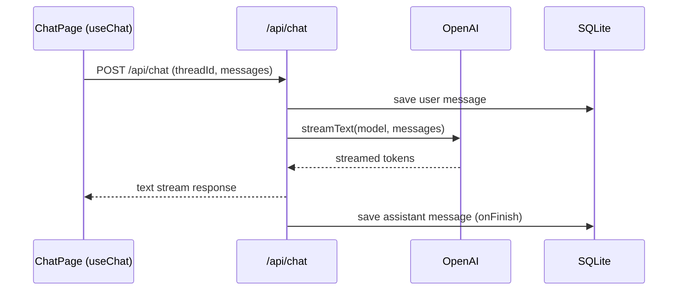

## AI Chat (Next.js + Bun + SQLite)

### What This Program Is

A simplified ChatGPT-like interface with conversation threads, message persistence, and Generative UI tools. It includes a sidebar for thread history, a streaming chat area, confirmation UI for destructive actions, XLSX tooling with range mentions, and optional file uploads for context.

### Tech Stack

- Next.js 16 (App Router) + TypeScript
- Vercel AI SDK (`useChat`, tool calling)
- Bun runtime + SQLite (via `better-sqlite3`)
- React + Tailwind CSS

### Setup

- Install dependencies: `bun install`
- Allow native SQLite bindings:
  - `bun pm trust better-sqlite3`
  - `bun install`
- Add the sample workbook:
  - `mkdir data`
  - place `example.xlsx` at `./data/example.xlsx`
- (Optional) Uploads folder is created automatically at `./data/uploads`
- Set your API key in `./.env.local`:
  - `OPENAI_API_KEY=...`

### Bun Commands

- `bun dev` run the dev server
- `bun run build` build for production
- `bun start` start the production server
- `bun lint` lint
- `bun test:e2e` run Playwright e2e tests

### Playwright Setup

- Install browsers once: `bunx playwright install`

### Database Initialization

- SQLite initializes automatically on first request.
- Default DB path: `./data/app.db` (override with `SQLITE_PATH`).

### XLSX Location

- XLSX tools read/write `./data/example.xlsx`.
- The app will error if the file is missing.

### Uploads

- Files uploaded in the UI are stored in `./data/uploads`.
- Only text/CSV/JSON contents are injected into the model context (first ~5k chars).
- Max file size: 5MB.

### Status

**Fully implemented**
- Chat threads + messages persisted in SQLite.
- Streaming responses via `/api/chat`.
- Thread creation, switching, and deletion.
- XLSX tools: `getRange`, `updateCell` (confirmation-gated), `explainFormula`.
- Edit prompts and regenerate response (deletes later messages).
- Delete prompts/responses with confirmation modal.
- File uploads with context injection.

**Partially implemented**
- Generative UI tool rendering (confirm card is wired; other tool UIs are basic).
- Table modal uses sample data (not yet wired to XLSX preview).

**Limitations**
- No auth or multi-user isolation.
- XLSX updates are direct file writes (single-writer expected).
- Tooling is enabled only when prompts include `@Sheet!A1:B3` range references.
- File uploads are text-only for context (binary files ignored).
- E2E coverage is minimal (smoke only).

### Evaluation Criteria Notes

- Chat, threads, persistence: implemented.
- Client tools + confirmation flows: implemented, but still basic.
- XLSX read/write + modal + mentions: partially implemented.
- Code structure and typing: separated API/DB/UI layers with typed models.
- UI/UX: minimal but functional.
- Bonus e2e tests: basic Playwright smoke test included.

### Requirement Mapping

**Meets**
- Next.js 16 App Router + TypeScript.
- Thread list, create, switch, delete; messages persisted in SQLite.
- `/api/chat` integrated with `useChat` and streaming.
- README covers setup/run/db/xlsx.

**Not fully met**
- Bun built‑in SQLite (`bun:sqlite`) is not used; current driver is `better-sqlite3`.
- Generative UI tools are partially wired; only confirmation UI is fully interactive.
- XLSX end‑to‑end flow is incomplete:
  - tool results are not rendered as tables in chat,
  - table modal uses sample data instead of XLSX output,
  - range mentions are not fully interpreted into tool calls.

**What’s needed to reach full compliance**
- Replace DB driver with Bun’s built‑in `bun:sqlite`.
- Wire tool results into chat UI (table previews + click‑to‑open modal).
- Feed XLSX tool output into the modal grid and selection.
- Parse `@Sheet!A1:B3` mentions and invoke XLSX tools consistently.

### Request/Response Flow

## Architecture Diagrams

Below are a few quick diagrams (Mermaid) to illustrate the system structure, runtime flow, and DB schema. You can render these in any Markdown viewer that supports Mermaid.

**UML: Class Diagram**

Mermaid source: [docs/diagrams/class-diagram.mmd](docs/diagrams/class-diagram.mmd)

**UML: Component Diagram (high-level)**

Mermaid source: [docs/diagrams/component-diagram.mmd](docs/diagrams/component-diagram.mmd)

**Flowchart: Request / Response Flow**

Mermaid source: [docs/diagrams/flowchart.mmd](docs/diagrams/flowchart.mmd)

**ERD: Database Schema (SQLite)**

Mermaid source: [docs/diagrams/erd.mmd](docs/diagrams/erd.mmd)

Mermaid source files for these diagrams are available in `docs/diagrams/`.

If you'd like, I can:
- export these diagrams to PNG/SVG files and add them to `public/` for visual embedding,
- refine class/ERD fields to match the actual schema in `src/lib/db`, or
- add a dedicated `docs/diagrams` folder with rendered assets.

### Developer Notes / Recent Changes

- Keyboard send: pressing Enter in the chat input now submits the message (use Shift+Enter for a newline). The messages view auto-scrolls to show new messages.
- Visual cue: a brief "Sent" toast appears when a message is submitted via the keyboard.
- File uploads: files attached with the UI are uploaded to `POST /api/uploads` and stored under `./data/uploads`. Text/CSV/JSON uploads are injected into the model context (first ~5k chars); max file size is 5MB. The chat request includes `fileIds` so the server reads and prepends file previews to the model input.
- Bugfix: attachments are now preserved during submit (they are cleared only after the request is sent), preventing "no file attached" responses.
- Diagrams viewer: Mermaid sources live in `docs/diagrams/` and are also copied to `public/diagrams/` with a small viewer at `/diagrams/index.html`.
- Export helper: run `npm run render:diagrams` to export SVGs from `docs/diagrams` into `public/diagrams` using `@mermaid-js/mermaid-cli`.

Quick test checklist:

1. Start the dev server: `bun dev` (or `npm run dev`).
2. In the UI attach a text/CSV/JSON file via the "Attach file" button.
3. Type a prompt asking for a summary and press Enter to send.
4. Confirm the assistant's response references the uploaded file content and the "Sent" toast appears.

